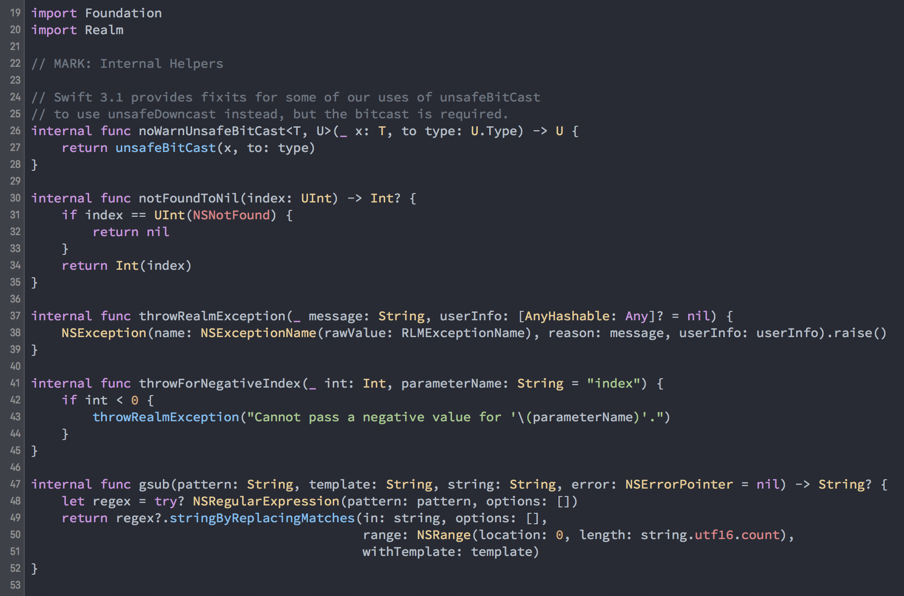

# 🎨 My Xcode theme

This repository contains the Xcode theme that I use. Feel free to use it or modify it to your liking 👍

* 📝 **FONT** : Adobe's Source Code Pro [github.com/adobe-fonts/source-code-pro](https://github.com/adobe-fonts/source-code-pro)
* 🎨 **Color** : Atome One dark with some change [github.com/atom/one-dark-syntax](https://github.com/atom/one-dark-syntax)

## Preview


## Installing using Marathon

The easiest way to install this Xcode theme is using **[Marathon](https://github.com/johnsundell/marathon):**

1. Install the latest version of Marathon if you haven't already:
```
$ git clone https://github.com/johnsundell/marathon.git
$ cd Marathon && make
```

2. Run the install script which will install [Adobe's Source Code Pro](https://github.com/adobe-fonts/source-code-pro) font & this Xcode theme for you:
```
marathon run poissonballon/xcodetheme
```

## Inspiration
* This repository largely (completely) inspired by [johnsandall's one](https://github.com/JohnSundell/XcodeTheme) thanks to him.
